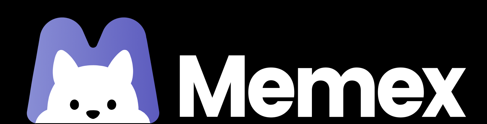

<p align="center">
    <picture>
          
    </picture>
</p>
<p align="center">
  A local-first, AI-native personal journal. Capture life in fragments — text, photos, voice — and let an on-device pipeline organize, summarize, and make them searchable.
</p>

<p align="center">
  <a href="README.md">English</a> | <a href="README_CN.md">简体中文</a>
</p>

<p align="center">
  <a href="LICENSE"></a>
  
  
</p>

> **Forked from [memex-lab/memex](https://github.com/memex-lab/memex) and modified in 2026** for a fully local, single-user setup. It removes the cloud-oriented and heavy multi-agent features in favor of on-device capabilities that work well with a self-hosted LLM. Licensed under **GPL-3.0** — see [LICENSE](LICENSE).

## What is it?

A journal that doesn't ask you to sit down and write polished entries. You capture life in fragments — a line of text, a photo, a quick voice note — and the app turns each fragment into a structured timeline card, tracks your mood, rolls entries up into summaries, and lets you find anything later by keyword or meaning.

**Local-first, for real.** Your records, cards, summaries, and search embeddings all live on your device. There is no server storing your journal. You bring your own LLM provider, and requests go straight from your device to that provider. Run [Ollama](https://ollama.com/) locally for a fully offline setup, or point it at OpenAI / Claude / Gemini / Bedrock.

## Features

- **Quick capture** — text, photos, and voice notes become typed timeline cards in a single fast pass.
- **Voice cards** — on-device transcription (SenseVoice via sherpa-onnx), with playback and a verbatim transcript.
- **Optional polish** — rewrite a raw note into a plain or a more literary version, compare them side by side, and edit before saving. The original text is kept and can be toggled back on any card.
- **Editable cards** — the model gets a word or an inference wrong sometimes, so a card's title and body stay editable after generation.
- **Mood tracking** — per-entry mood scoring and a deterministic mood curve over time.
- **Summaries** — automatic daily / weekly / monthly / yearly narrative rollups, with optional local reminders (including a year-end one; reminder copy is currently Chinese only).
- **Search & Q&A** — hybrid keyword + semantic search (bge-m3 embeddings, RRF fusion) with tappable source cards.
- **Memory book export** — export a date range to a cover + timeline PDF (with bundled CJK fonts) via the system share sheet.
- **Goal & media cards** — track goals and log books, films, shows, and music, with a browsable media library.
- **Calendar sync** — card due dates can be mirrored into the device calendar.
- **Backups** — manual export, automatic daily on-device snapshots, and optional daily backup to a folder in iCloud Drive (rolling two copies) that survives an app reinstall.
- **You can stop the AI** — when a model stops responding, terminate queued and running AI work instead of waiting out timeouts and retries.

## Tech stack

- **Flutter** (Dart ≥ 3.6), Material 3
- **MVVM + Provider**, sealed `Result` type, `Command` pattern
- **Drift** (SQLite) for local storage
- **fl_chart** for charts, **GoRouter** for navigation
- On-device ML via **Google ML Kit** (OCR / image labeling); local speech-to-text via **sherpa-onnx**

## Build

```bash
flutter pub get
cd ios && pod install && cd ..
flutter run
```

Then open **Settings** in the app and configure your LLM provider. For a fully offline setup, run Ollama on your machine and point the app at its address.

> iOS builds use a placeholder bundle identifier and no development team. Set your own in Xcode (`ios/Runner.xcodeproj`) before deploying to a device.

## License

[GPL-3.0](LICENSE). This fork retains the upstream project's license; all modifications are likewise GPL-3.0.
